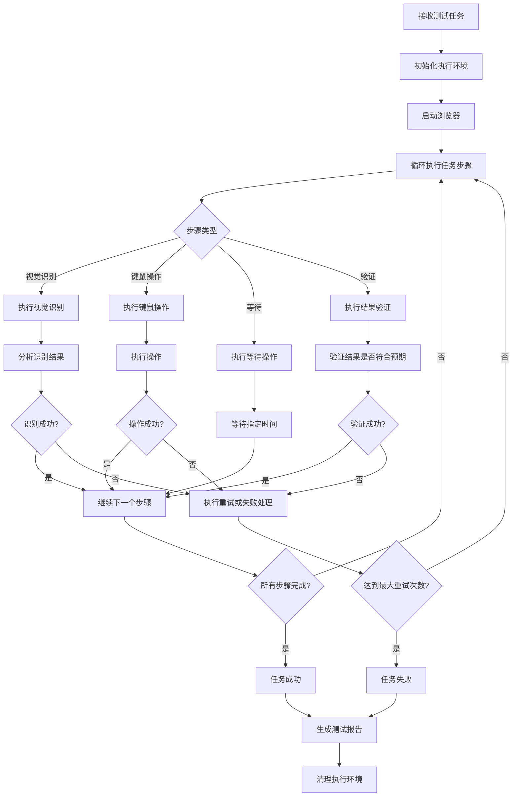
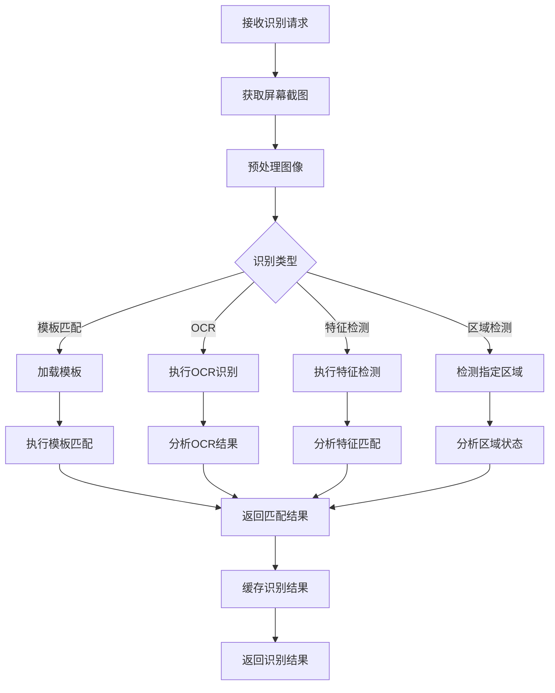

# Web端视觉驱动自动化测试平台架构文档

## 1. 系统概述

基于MAA（MAAAssistantArknights）核心设计理念，开发的工业级Web端视觉驱动自动化测试平台。该平台采用纯视觉识别+键鼠模拟的方式，不依赖Web页面DOM结构，可适配所有Web框架。

### 核心特性

1. **跨平台输入**：支持Windows/macOS/Linux的键鼠控制适配
2. **高精度视觉识别**：融合模板匹配+OCR+特征检测
3. **任务流管理**：支持自定义测试任务，包含重试、错误处理、日志记录
4. **无侵入性**：纯视觉识别+键鼠模拟，适配所有Web框架
5. **可视化配置**：Web前端页面支持可视化配置测试任务

## 2. 系统架构

### 2.1 分层设计

```
┌──────────────────────────────────────────────────────────────────────────┐
│                           Web前端层                                     │
│ ┌─────────────────────┐  ┌─────────────────────┐  ┌────────────────────┐ │
│ │ 任务配置模块        │  │ 视觉配置模块        │  │ 执行控制模块       │ │
│ └─────────────────────┘  └─────────────────────┘  └────────────────────┘ │
├──────────────────────────────────────────────────────────────────────────┤
│                           API接口层                                     │
│ ┌─────────────────────┐  ┌─────────────────────┐  ┌────────────────────┐ │
│ │ 任务管理接口        │  │ 识别服务接口        │  │ 执行控制接口       │ │
│ └─────────────────────┘  └─────────────────────┘  └────────────────────┘ │
├──────────────────────────────────────────────────────────────────────────┤
│                           核心服务层                                     │
│ ┌─────────────────────┐  ┌─────────────────────┐  ┌────────────────────┐ │
│ │ 任务调度服务        │  │ 视觉识别服务        │  │ 输入控制服务       │ │
│ └─────────────────────┘  └─────────────────────┘  └────────────────────┘ │
├──────────────────────────────────────────────────────────────────────────┤
│                           底层驱动层                                     │
│ ┌─────────────────────┐  ┌─────────────────────┐  ┌────────────────────┐ │
│ │ 系统原生API         │  │ 图像采集模块        │  │ 键鼠控制模块       │ │
│ └─────────────────────┘  └─────────────────────┘  └────────────────────┘ │
└──────────────────────────────────────────────────────────────────────────┘
```

### 2.2 核心模块

#### 2.2.1 输入控制模块

参考MAA的ControlUnit设计，实现跨平台的键鼠控制：

- **Windows**：调用user32.dll实现原生键鼠操作
- **macOS**：使用CoreGraphics框架
- **Linux**：使用X11或Wayland接口

核心功能：
- 鼠标移动（精确坐标）
- 鼠标点击（左键/右键/中键）
- 键盘输入（单键/组合键）
- 滚轮操作
- 拖拽操作

#### 2.2.2 视觉识别模块

融合多种识别技术：

- **模板匹配**：基于OpenCV的模板匹配，识别固定UI元素
- **OCR识别**：使用PaddleOCR识别文本内容
- **特征检测**：使用SIFT/SURF等算法识别复杂元素
- **区域检测**：识别特定区域的存在性

#### 2.2.3 任务管理模块

参考MAA的TaskInfo/ProcessTaskAction设计：

- **任务定义**：支持自定义测试流程
- **任务执行**：按顺序执行任务步骤
- **错误处理**：支持任务重试、失败处理
- **状态管理**：实时更新任务执行状态
- **日志记录**：详细记录任务执行过程

#### 2.2.4 Web前端模块

- **任务配置**：可视化配置测试任务
- **视觉配置**：交互式选择识别区域
- **执行控制**：启动/暂停/停止测试任务
- **结果展示**：实时展示测试结果和日志

## 3. 核心流程

### 3.1 测试任务执行流程



### 3.2 视觉识别流程



## 4. 接口定义

### 4.1 任务管理接口

#### 4.1.1 创建测试任务

- **URL**: `/api/tasks`
- **Method**: POST
- **Request Body**:
  ```json
  {
    "name": "登录测试",
    "description": "测试登录功能",
    "steps": [
      {
        "type": "click",
        "target": {
          "type": "template",
          "template_name": "login_button"
        },
        "retry_count": 3,
        "retry_interval": 2
      },
      {
        "type": "type",
        "text": "username",
        "target": {
          "type": "ocr",
          "keyword": "用户名"
        }
      }
    ]
  }
  ```
- **Response**:
  ```json
  {
    "task_id": "task_123",
    "status": "created",
    "message": "Task created successfully"
  }
  ```

#### 4.1.2 启动测试任务

- **URL**: `/api/tasks/{task_id}/start`
- **Method**: POST
- **Response**:
  ```json
  {
    "task_id": "task_123",
    "status": "running",
    "message": "Task started successfully"
  }
  ```

#### 4.1.3 获取任务状态

- **URL**: `/api/tasks/{task_id}/status`
- **Method**: GET
- **Response**:
  ```json
  {
    "task_id": "task_123",
    "status": "running",
    "current_step": 2,
    "total_steps": 5,
    "progress": 40,
    "logs": [
      "Step 1: Click login button - Success",
      "Step 2: Type username - In progress"
    ]
  }
  ```

### 4.2 识别服务接口

#### 4.2.1 模板匹配

- **URL**: `/api/recognize/template`
- **Method**: POST
- **Request Body**:
  ```json
  {
    "template_name": "login_button",
    "threshold": 0.8,
    "region": {
      "x": 0,
      "y": 0,
      "width": 1920,
      "height": 1080
    }
  }
  ```
- **Response**:
  ```json
  {
    "success": true,
    "result": {
      "x": 100,
      "y": 200,
      "width": 80,
      "height": 30,
      "score": 0.95
    }
  }
  ```

#### 4.2.2 OCR识别

- **URL**: `/api/recognize/ocr`
- **Method**: POST
- **Request Body**:
  ```json
  {
    "region": {
      "x": 0,
      "y": 0,
      "width": 1920,
      "height": 1080
    },
    "keywords": ["登录", "用户名", "密码"]
  }
  ```
- **Response**:
  ```json
  {
    "success": true,
    "results": [
      {
        "text": "登录",
        "x": 100,
        "y": 150,
        "width": 50,
        "height": 20,
        "score": 0.98
      },
      {
        "text": "用户名",
        "x": 80,
        "y": 200,
        "width": 60,
        "height": 20,
        "score": 0.96
      }
    ]
  }
  ```

### 4.3 执行控制接口

#### 4.3.1 执行鼠标点击

- **URL**: `/api/control/click`
- **Method**: POST
- **Request Body**:
  ```json
  {
    "x": 100,
    "y": 200,
    "button": "left",
    "delay": 0.5
  }
  ```
- **Response**:
  ```json
  {
    "success": true,
    "message": "Click executed successfully"
  }
  ```

#### 4.3.2 执行键盘输入

- **URL**: `/api/control/type`
- **Method**: POST
- **Request Body**:
  ```json
  {
    "text": "username",
    "delay": 0.1
  }
  ```
- **Response**:
  ```json
  {
    "success": true,
    "message": "Text input executed successfully"
  }
  ```

## 5. 技术栈

### 5.1 后端技术栈

| 技术/库 | 版本 | 用途 | 参考MAA特性 |
|---------|------|------|------------|
| Python | 3.9+ | 核心开发语言 | - |
| FastAPI | 0.104+ | Web框架，提供API接口 | - |
| Playwright | 1.39+ | 浏览器控制 | 类似MAA的浏览器控制 |
| PaddleOCR | 2.7+ | 文本识别 | 类似MAA的OCR模块 |
| OpenCV | 4.8+ | 图像处理和模板匹配 | 类似MAA的视觉识别 |
| NumPy | 1.24+ | 数值计算 | - |
| pydantic | 2.5+ | 数据验证 | - |
| uvicorn | 0.24+ | ASGI服务器 | - |
| win32api (Windows) | - | 原生Windows API调用 | 类似MAA的Win32ControlUnit |
| Quartz (macOS) | - | 原生macOS API调用 | 类似MAA的MacOSControlUnit |
| Xlib (Linux) | - | 原生Linux API调用 | - |

### 5.2 前端技术栈

| 技术/库 | 版本 | 用途 |
|---------|------|------|
| Vue 3 | 3.3+ | 前端框架 |
| Element Plus | 2.4+ | UI组件库 |
| Vite | 5.0+ | 构建工具 |
| Axios | 1.6+ | HTTP客户端 |
| Pinia | 2.1+ | 状态管理 |
| Vue Router | 4.2+ | 路由管理 |
| Canvas API | - | 视觉区域选择 |

## 6. 部署方案

### 6.1 本地部署

1. **安装依赖**：
   ```bash
   # 后端依赖
   cd backend
   pip install -r requirements.txt
   
   # 前端依赖
   cd ../frontend
   npm install
   ```

2. **启动服务**：
   ```bash
   # 启动后端
   cd backend
   python main.py
   
   # 启动前端
   cd ../frontend
   npm run dev
   ```

### 6.2 Docker部署

1. **构建镜像**：
   ```bash
   docker build -t web-automation-platform .
   ```

2. **运行容器**：
   ```bash
   docker run -p 8000:8000 -p 3000:3000 web-automation-platform
   ```

## 7. 性能优化策略

### 7.1 识别性能优化

- **图像压缩**：在保证识别精度的前提下，压缩截图尺寸
- **识别缓存**：缓存已识别的元素位置，避免重复识别
- **并行处理**：使用多线程并行执行识别任务
- **区域限制**：只在指定区域内进行识别，减少计算量

### 7.2 执行性能优化

- **键鼠操作防抖**：优化键鼠操作的延迟和精度
- **批量操作**：合并多个连续的键鼠操作，减少系统调用
- **智能等待**：基于视觉识别的智能等待，而非固定延时
- **资源管理**：合理管理浏览器进程和系统资源

### 7.3 系统性能优化

- **内存管理**：优化内存使用，避免内存泄漏
- **CPU使用**：合理分配CPU资源，避免系统过载
- **网络优化**：优化API调用和数据传输
- **日志优化**：分级日志，避免过多日志影响性能

## 8. 与传统Web自动化工具对比

| 特性 | 视觉驱动测试平台 | Selenium | Playwright |
|------|-----------------|----------|------------|
| 依赖DOM结构 | 否 | 是 | 是 |
| 支持所有Web框架 | 是 | 是 | 是 |
| 跨平台兼容性 | 是 | 是 | 是 |
| 视觉识别能力 | 强 | 弱 | 弱 |
| 键鼠操作精度 | 高 | 中 | 中 |
| 无侵入性 | 是 | 否 | 否 |
| 支持复杂UI元素 | 是 | 有限 | 有限 |
| 部署复杂度 | 中 | 低 | 低 |
| 性能消耗 | 中 | 低 | 低 |
| 适用场景 | 复杂Web应用、动态内容、跨框架测试 | 常规Web测试 | 现代Web测试 |

### 8.1 优势

1. **无侵入性**：不依赖Web页面DOM结构，可测试任何Web应用
2. **视觉识别**：能够识别复杂UI元素，包括动态加载内容、Iframe等
3. **跨框架兼容**：适配所有Web框架（Vue/React/Angular等）
4. **高精度操作**：基于视觉识别的精确键鼠操作
5. **场景覆盖广**：可覆盖电商、表单、后台管理系统等多种场景

### 8.2 劣势

1. **性能消耗**：视觉识别比DOM操作消耗更多资源
2. **部署复杂度**：需要安装额外的视觉识别依赖
3. **识别精度**：受限于图像质量和识别算法
4. **执行速度**：视觉识别过程比DOM操作慢

## 9. 应用场景

### 9.1 电商网站测试

- **商品搜索**：测试搜索功能和结果展示
- **购物车操作**：测试添加、删除、修改商品
- **结账流程**：测试完整的结账流程
- **促销活动**：测试促销活动展示和应用

### 9.2 表单系统测试

- **登录注册**：测试登录、注册、找回密码功能
- **数据录入**：测试各种表单字段的输入和验证
- **文件上传**：测试文件上传功能
- **表单提交**：测试表单提交和结果处理

### 9.3 后台管理系统测试

- **用户管理**：测试用户的增删改查
- **权限控制**：测试不同权限的访问控制
- **数据统计**：测试数据统计和报表功能
- **系统设置**：测试系统配置和管理功能

## 10. 未来扩展

1. **AI增强**：集成AI模型，提高视觉识别精度和智能化程度
2. **移动设备支持**：扩展到移动设备的Web测试
3. **云服务**：提供云端测试服务，支持分布式执行
4. **测试报告增强**：提供更详细的测试报告和分析
5. **集成CI/CD**：与持续集成/持续部署系统集成

## 11. 结论

基于MAA核心设计理念的Web端视觉驱动自动化测试平台，通过纯视觉识别+键鼠模拟的方式，实现了对各种Web应用的无侵入式测试。该平台具有跨平台兼容性、高精度视觉识别、灵活的任务流管理等特点，能够满足工业级Web应用测试的需求。

与传统的Web自动化工具相比，视觉驱动的测试方式具有更强的适应性和扩展性，能够应对现代Web应用的复杂场景。虽然在性能和部署复杂度方面存在一定劣势，但通过合理的优化策略，可以在保证测试质量的同时，提高测试效率。
